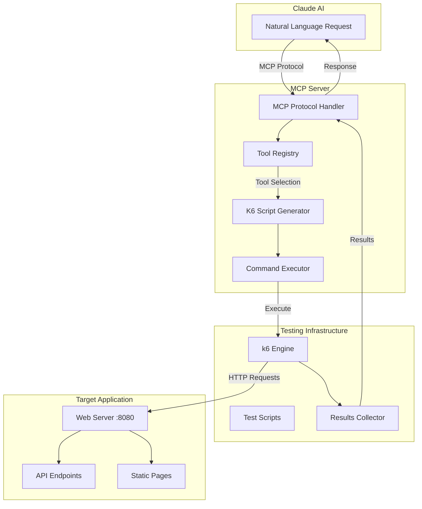
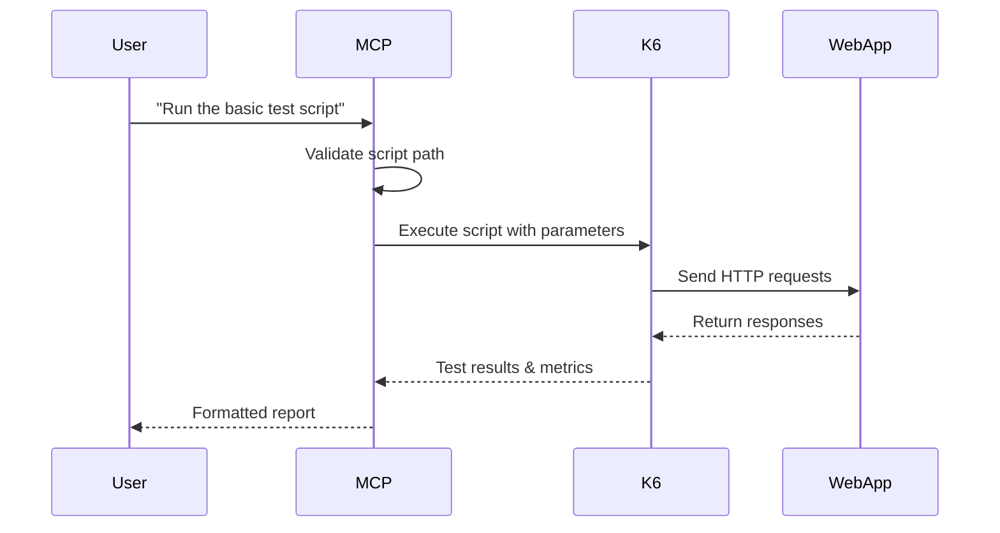
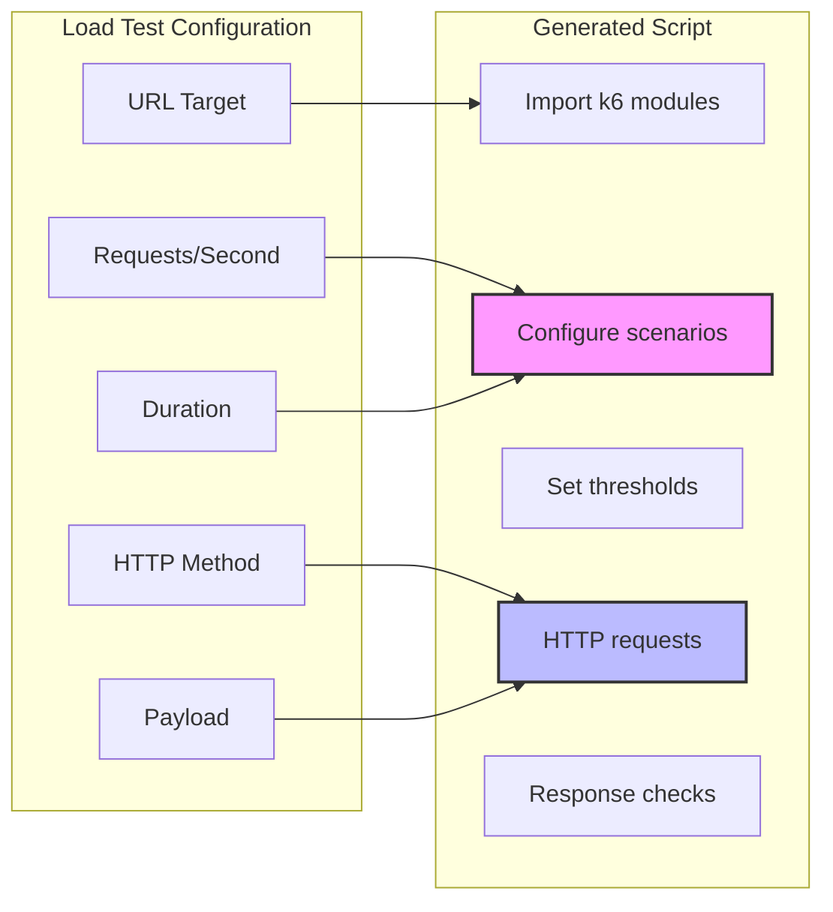
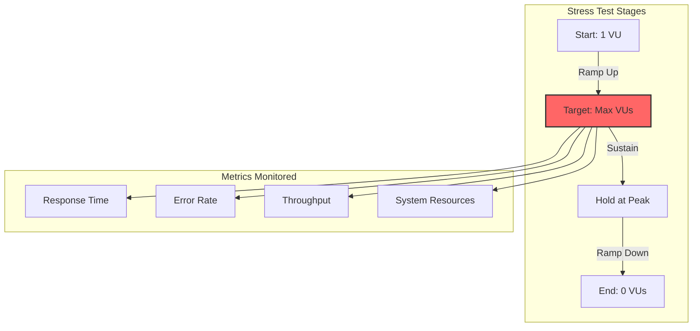
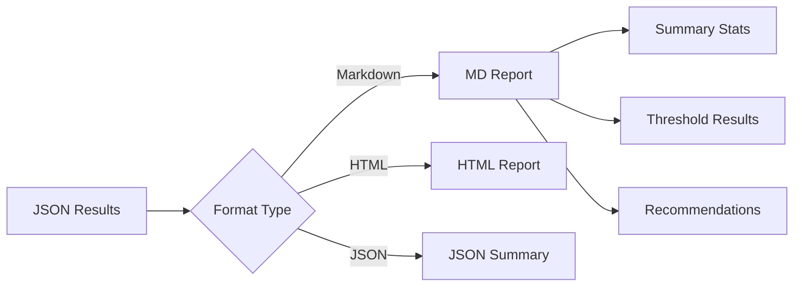
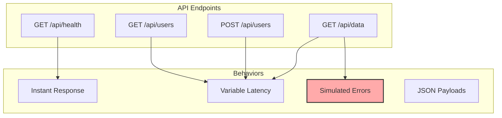
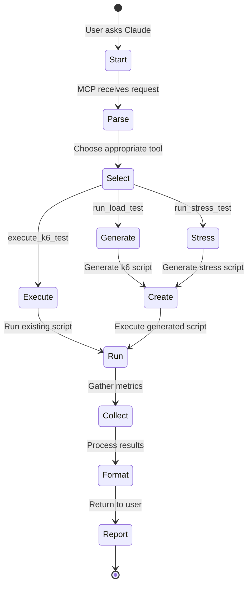

# Step 0: Foundation - K6 Performance Testing MCP Server

## Overview

Step 0 establishes the foundation for AI-driven performance testing. This step provides:
- A basic MCP server that can execute k6 performance tests
- Dynamic k6 script generation for common test patterns
- A sample web application with realistic API endpoints for testing

## Architecture



## Capabilities

### 1. **Execute K6 Test** (`execute_k6_test`)
Run custom k6 scripts with configurable parameters.



**Parameters:**
- `script` (required): Path to k6 test script
- `vus`: Virtual users (default: 10)
- `duration`: Test duration (default: 30s)

### 2. **Run Load Test** (`run_load_test`)
Generate and execute constant-rate load tests dynamically.



**Features:**
- Constant arrival rate executor
- Automatic VU scaling
- Response time validation
- Error rate monitoring

### 3. **Run Stress Test** (`run_stress_test`)
Find system breaking points through progressive load increase.



The `generateStressTestScript` function creates a k6 script with:
- Progressive load stages
- Configurable ramp-up duration
- Peak load sustain period
- Graceful ramp-down
- Performance thresholds

### 4. **Generate Report** (`generate_report`)
Transform k6 results into readable reports.



## Step 0 Components

### Web Server (`web/main.go`)
A Go HTTP server running on port 8080 that provides realistic endpoints for testing:



### MCP Server (`mcp/main.go`)
The MCP server exposes four tools that can be called via the Model Context Protocol:

1. **execute_k6_test** - Runs existing k6 scripts with JSON output collection
2. **run_load_test** - Generates and runs constant-rate load tests with metrics
3. **run_stress_test** - Generates and runs progressive stress tests with analysis
4. **generate_report** - Parses k6 JSON output and creates formatted reports (markdown/html/json)

## Usage Workflow



## What Step 0 Provides

### Foundation Elements
1. **Basic MCP Integration** - Simple request/response pattern with k6
2. **Script Generation** - Two patterns: constant load and progressive stress
3. **Test Target** - A working web application to test against
4. **Error Handling** - Basic error reporting from k6 execution
5. **Report Generation** - Parses k6 JSON output to extract key metrics:
   - Response time statistics (avg, min, max)
   - Success/failure rates
   - Data transfer metrics
   - Virtual user counts

### Current Limitations (To Be Addressed in Future Steps)
- No script discovery or management
- No real-time monitoring during tests
- Single-node execution only
- No test history or comparison
- Limited script customization options

## Step 0 Implementation Details

### Script Generation Functions

**`generateLoadTestScript`**
- Creates k6 script with constant-arrival-rate executor
- Configurable RPS, duration, HTTP method, and payload
- Includes basic error rate tracking
- Sets performance thresholds

**`generateStressTestScript`**
- Creates k6 script with staged load increases
- Three stages: ramp-up, sustain, ramp-down
- Monitors for breaking point detection
- Simple but effective stress pattern

## Running Step 0

1. **Build the servers:**
   ```bash
   make build-step0
   # or use air for hot reload:
   air
   ```

2. **Start the web server:**
   ```bash
   ./bin/web-server-step0
   # Web server runs on :8080
   ```

3. **Configure and run the MCP server:**
   ```bash
   ./bin/mcp-server-step0
   ```

## Step 0 Summary

This foundational step demonstrates:
- Basic MCP server implementation with k6 integration
- Two script generation patterns (load and stress)
- A functional test target application
- Simple tool-based architecture

It's intentionally minimal to establish the core pattern of:
1. Receiving natural language requests via MCP
2. Translating them into k6 test executions
3. Returning results in a readable format

Future steps will build upon this foundation to add more sophisticated testing capabilities, monitoring, and analysis features.