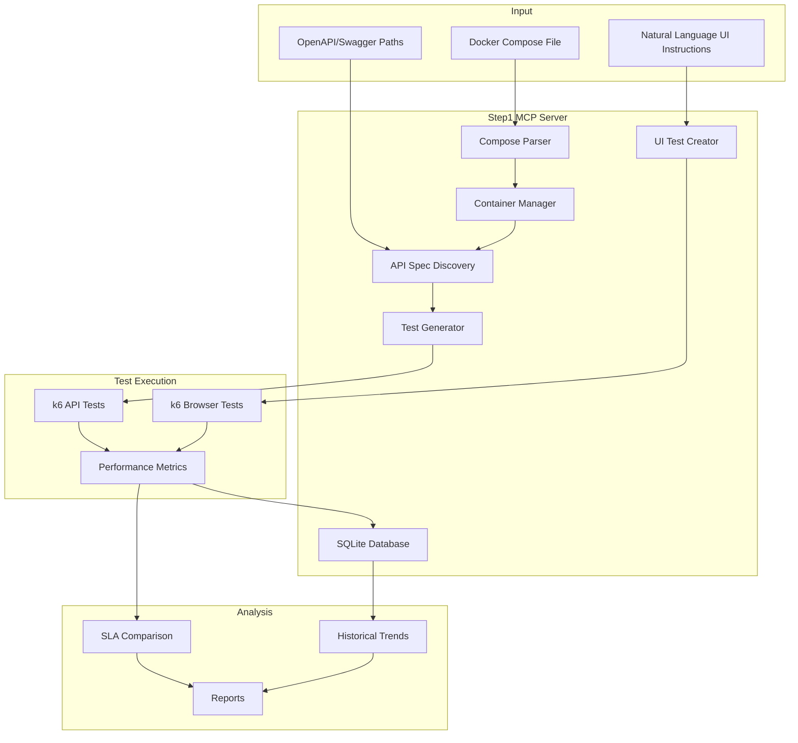

# Step 1: Dynamic Container Testing with OpenAPI Discovery

## Overview

Step 1 evolves from step0's static approach to a dynamic system that can:
- Accept Docker Compose files from URLs or local paths
- Store compose files in SQLite for complete portability
- Automatically manage container lifecycle (start/stop/cleanup)
- Discover OpenAPI/Swagger specifications from running services
- Generate k6 tests with endpoint filtering
- Create UI tests from natural language instructions
- Track performance over time with session-based architecture
- Compare results against SLAs

## Architecture

## Key Features

### 1. Docker Compose Integration
- Accepts compose files from URLs (GitHub, GitLab, etc.) or local paths
- Downloads and stores complete content in SQLite
- Creates unique temp directories for each test run
- Manages complete container lifecycle with unique project names
- Always cleans up containers and temp files, even on errors
- No filesystem dependencies or assumptions

### 2. OpenAPI/Swagger Discovery
- Accepts explicit spec paths or auto-discovers
- Supports both Swagger 2.0 and OpenAPI 3.0
- Extracts endpoints, methods, and parameters
- Identifies response time hints and SLAs

### 3. Natural Language UI Testing
- Converts instructions like "Click login button, enter username" to k6 browser tests
- Simple action vocabulary: click, type, select, wait
- Automatic selector generation
- Screenshot capture on failures

### 4. SQLite Performance Database
Schema includes:
- Test runs with timestamps and configurations
- Service definitions from compose files
- API endpoints and their SLAs
- Performance metrics per endpoint
- Historical comparisons

### 5. Intelligent Test Generation
- Creates appropriate test patterns per endpoint
- GET endpoints: Read-heavy load tests
- POST/PUT: Write scenarios with realistic data
- DELETE: Careful testing with data cleanup
- Configurable load patterns

## MCP Tools

### Traditional Tools (Step-by-Step)

#### setup_test_environment
Fetches Docker Compose file from path or URL, stores in SQLite, creates test session.

#### discover_api_specs
Writes compose to temp location, starts containers, discovers OpenAPI/Swagger specs, stops containers.

#### generate_api_tests
Creates k6 test scripts from discovered API specifications with filtering.

#### create_ui_test
Generates k6 browser tests from natural language instructions.

#### run_performance_test
Writes compose to temp, starts containers, executes tests, stops and removes all containers.

#### analyze_results
Compares results against SLAs and historical data.

#### query_test_history
Retrieves historical performance data for trend analysis.

### Automated Tools (All-in-One)

#### test_application
Complete automated testing from Docker Compose source:
- Fetches compose file (URL or path)
- Stores in database with unique session
- Starts containers in isolated environment
- Discovers API specifications
- Generates and runs appropriate tests
- **Supports endpoint filtering** (comma-separated list)
- Provides comprehensive report
- Cleans up all resources

Parameters:
- `composeSource` (required): URL or path to docker-compose.yml
- `testType`: quick, standard, or thorough (default: standard)
- `endpoints`: Comma-separated endpoints to test (optional)

#### quick_performance_test
Rapid performance test with custom parameters:
- Accepts compose source (URL or path)
- Configurable VUs and duration
- Simplified test execution
- Quick results with minimal setup

## What's New from Step 0

1. **Dynamic Discovery** - No hardcoded endpoints or test scripts
2. **Container Orchestration** - Full Docker Compose support
3. **Persistent Storage** - SQLite for historical tracking
4. **SLA Management** - Automatic extraction and monitoring
5. **Natural Language** - UI test creation from plain English
6. **Multi-Service** - Test entire applications, not just single services

## What's New in Our Implementation

- **URL Support**: Compose files can be fetched from any public URL
- **Complete Isolation**: Each test runs in temp directories with unique project names
- **Endpoint Filtering**: Test specific endpoints instead of everything
- **Session-Based**: All operations tracked with unique session IDs
- **Automatic Cleanup**: Guaranteed cleanup of containers and temp files

## MCP Resources

The MCP server exposes the following resources for inspecting the SQLite database:

### sqlite://schema
- Returns the complete database schema as formatted SQL
- Shows all tables and their structures
- Useful for understanding the data model

### sqlite://sessions
- Returns recent test sessions (last 20)
- Includes session name, status, source URL, and service count
- JSON format with timestamp information

### sqlite://compose-files
- Returns stored Docker Compose files metadata
- Shows source URL, hash, creation time, and file size
- Helps track which compose files have been tested

### sqlite://test-runs
- Returns recent test run results (last 20)
- Includes VUs, duration, test type, and session info
- Essential for performance history tracking

## Limitations (Kept Simple)

- No authentication/authorization complexity
- Basic UI actions only (no complex flows)
- Single-node testing (no distributed load)
- Simple SLA rules (response time and error rate)
- No service mesh or advanced networking
- Compose files must have all values (no external env vars)
